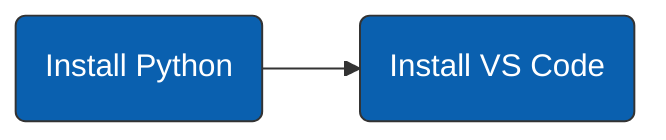

--- 
title: 2 in 1 Learn Python and Linux. Part 1 - Basics.
date: 2022-10-19 12:25:00 +100
categories: [python, learn-in-30-minutes]
tags: [python, learning, tutorial, programming-language]
mermaid: true
---



### Step 1: Install tools


To get started we need to install following software:
- Python itself - allows us to run python programs.
- VS Code - allows us to easily write code.

1. Go to Python [website](https://www.python.org/downloads/)  or google "python download" 
2. Click the download button. 
3. Follow the normal installation steps. 
> When installing make sure to check the add to PATH checkbox. 
    {: .prompt-info }

Repeat this process with VS Code:

1. Go to their [website](https://code.visualstudio.com/download) or google "VS Code download"
2. Click the download button. 
3. Follow the normal installation steps. 
> When installing make sure to check the add to PATH checkbox.
    {: .prompt-info }


### Step 2: Setup VS Code

First we're going to install some VS Code extensions:
1. Open VS Code
2. On the left-hand side click to Extensions.
3. search and install following extensions:
    - Python (Microsoft)
    - Code Runner
    - Code Spell Checker

Next, go to File -> Preferences -> Settings. Here you're going to search and change following settings:
- **Auto save.** Set it to afterDelay.
- **Bracket Pair Colorization.** Set it to Enabled by cicking to the checkbox.

  
### Step 3: Write your first hello world program

Let's now write our first hello world program. In python it's very simple, for that we use the "print" command.
> As you might have guessed, the print command prints something. But don't worry, it doesn't require a **physical printer** to do its job, instead it's going to print text in your **terminal**.
{: .prompt-info }

1. Open the VS Code.
2. On the right hand side click to Explorer
3. Right click on the empty space and select "New File"
4. Give the file a name, for example "test.py"
5. In the editor type the text below and lick to the Run Code button on the right top corner

```python
print('hello world') 
```
> Congratulations, you wrote your first Python program! 
{: .prompt-tip }

The same program can be changed a little bit with variable, try to update you program with the below text and see what will happen:
```python
variable = "hello world"
print(variable)
```

##### Exercise

- Create a variable with name "name" and assign your name to it.
- Print the variable on the terminal.

### Step 4: Learn more about the commands

- In Python the commands are called **functions**. 
- In some cases the commands are also called **methods**.
- To execute a function (or a command) you place a pair of **parentheses** () at the end of the function name:
  ```python
function()
  ```
- Functions may or may not take input values, if they do you put them inside the parentheses like this.  
  ```python
function(input_value)
  ```


##### Exercise
You need to write and execute a program with following content:
- First line defines a variable with your name
- Second line prints your name
- Third line executes print function w/o input value
- Fourth line prints your name once again

### Step 5: Learn more about the variables

A variable is simply a name you give to any object in Python. 
> We use the equals sign "=" between variable name and object we want to give this name to.
{: .prompt-info }

The examples of variables:
```python
string_variable = "text"
int_variable = 1
float_variable 1.0
list_variable = [1,2,3]
dict_variable = {"key": "value"}
```
##### About different kind of values

- As you might have noticed, in the variables above we store different kind of values: 
  - text
  - numbers
  - some collection of numbers
  - and even a mapping
- In Python they are called **data types**. 
- We're going to discuss all those data types in more details later in this tutorial. 

##### Couple of tips for creating variables:
- The name should be as **descriptive** as possible.
- By convention variables start with **lowercase**.
- If we have multiple words we separate them by **underscore** like this `my_variable`.
- Variable names **can't start with number**.


##### Exercise 
You need to create following variables:
- One which represents a year when you were born
- One which name consist of two words
- One which starts with a number
- Try to print the variables on the terminal and see what will happen.